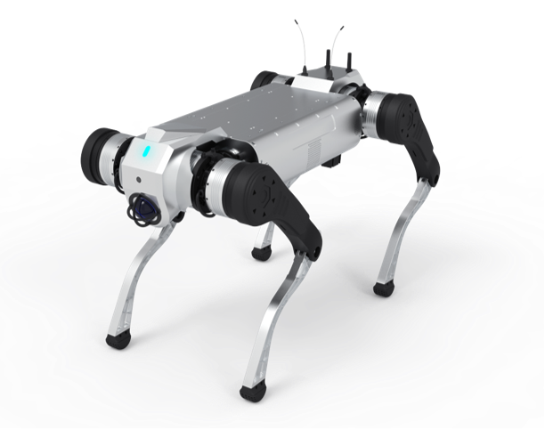

1.1 产品概述
============

智元酷拓四足机器人 D1 MaxPro，每条腿上有 3 个电机，拥有 12 个自由度，具备⾏⾛、⼩跑、爬楼梯，跨壕沟等运动能⼒。本产品的主要特点是负载能⼒强，续航⻓，复杂地形的适应能⼒强。同时，本产品开放了运动控制算法开发 SDK和通信协议，允许用户根据需要进行二次开发,其在多个关键功能及应用研发方面取得显著进展：
- **1.负重能力：**
主打大负重特性，长时负重可达 50 公斤，瞬时负重更是高达 100 公斤，负重能力相较于前代提升 2.5 倍，能够满足诸如物资运输、工业搬运等重载需求场景。 
- **2.自主巡逻与环境感知：**
可依赖激光雷达实现自主巡逻功能，并通过 4G 网络达成远程部署以及画面回传。同时集成了激光雷达、头部摄像头、IMU 以及 GPS 等丰富传感器，能够在复杂环境下进行全方位的环境感知，构建地图并规划路径，适应如公安巡逻、水务巡检、石油巡检等不同场景的应用。 
- **3.运动性能：**
具备出色的运动灵活性，能灵活上下 45° 的楼梯，稳健攀爬镂空工业楼梯，越障能力突出，可跨越单台阶 30cm 的障碍。摔倒恢复机制成熟，摔倒爬起时间小于 20 秒，能在复杂地形或意外状况下快速恢复作业状态。其空载速度达到 3m/s ，可快速响应突发任务需求，深入复杂场景与作业盲区。 
- **4.环境适应性：**
拥有 IP67 工业级防护，能在 - 20℃至 55℃的宽泛温度区间以及涉水深度 20cm 的环境下正常作业，无惧极寒酷暑、风雨天气，保证在多种恶劣自然条件下稳定运行。 
- **5.续航保障：**
电池电量为 2160Wh ，负载续航时间提升 28%，且电池支持现场快速拆换，为特殊任务以及行业应用中的紧急情况提供有力续航保障，减少停机时间，提升工作效率。

