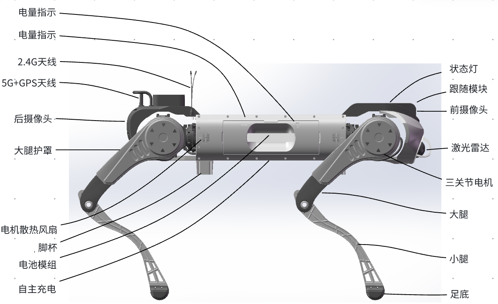

1.3 产品参数
============

| 分类         | 规格                 | 说明                     |
|-------------|----------------------|-------------------------|
| 基本参数     | 产品名称 | D1 MaxPro |
|             | 站立尺寸               | 1270*520*730mm |
|             | 趴下尺寸               | 1360*570*300mm |
|             | 整机重量  | 68±1kg |
| 电气参数     | 电池电量 | 2081Wh |
|             | 电池电压 | 48V±2V |
|             | 电池容量 | 48V±2V |
|             | 充电时间 | 约4.5h(电量10%-90%) |
| 运动参数     | 持续行走速度 | 0-1.2m/s |
|             | 最大空载冲刺速度 | 3m/s |
|             | 续航时间 | 空载5.5h，负载50kg下2h |
|             | 额定负载 | 50kg |
|             | 可攀爬台阶高度 | 30cm |
|             | 可攀爬角度 | 45° |
| 传感参数     | 广角相机 | 前相机:分辨率是1920x1080,帧率是30fps，HFOV是122°，HFOV是64.5° 后相机:分辨率是1080P,帧率是30FPS，对角FOV是120° |
|             | 激光雷达 | 前置一个96线激光雷达，覆盖角度360°* 90°，覆盖直径范围 120m，精度1.5cm |
| 环境参数     | 防尘防水 | IP67 |
|             | 工作温度 | -20~55℃ |

-  关节参数

| 部位         | 参数                 | 数值                     |
|-------------|----------------------|-------------------------|
| 机身 | 最大扭矩 | 180 N.m |
|             | 最大转速 | 136 RPM |
|             | 重量 | 1.407 Kg |
| 大腿 | 最大扭矩 | 300 Nm |
|             | 最大转速 | 147 RPM |
|             | 重量 | 2.57 Kg |
| 小腿 | 最大扭矩 | 300 N.m |
|             | 最大转速 | 114 RPM |
|             | 重量 | 2.57 Kg |