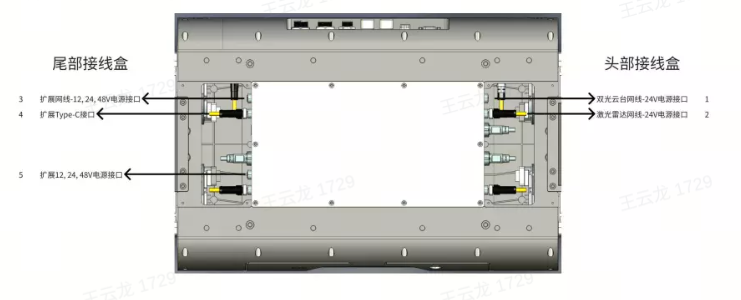
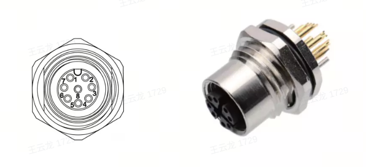
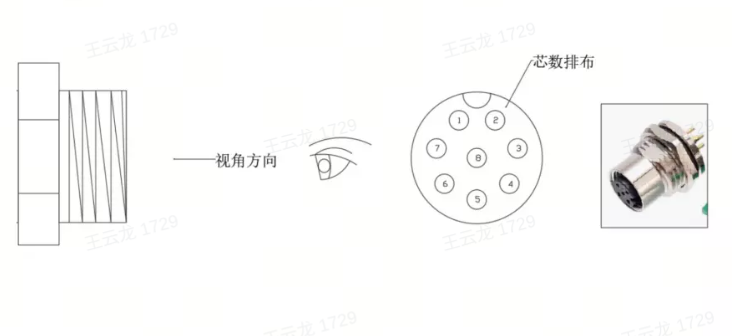
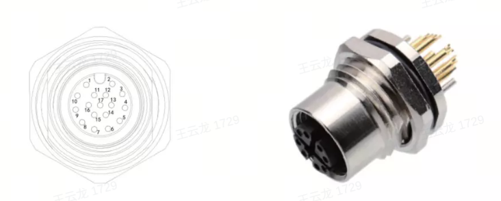
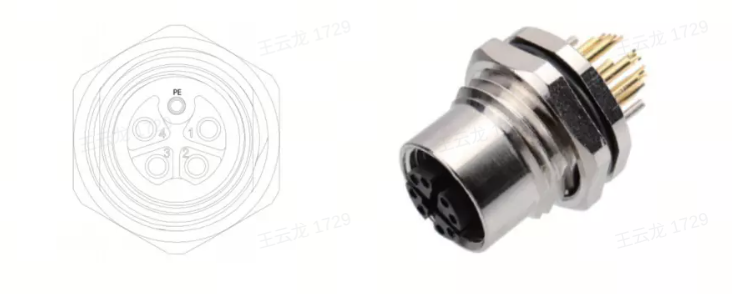
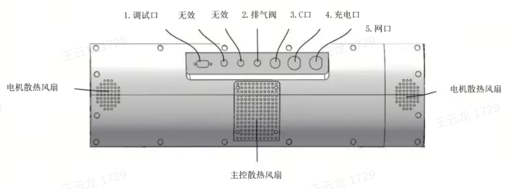
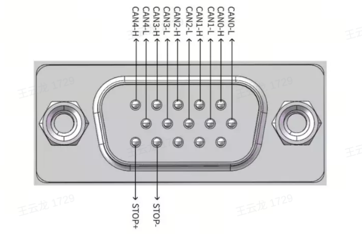
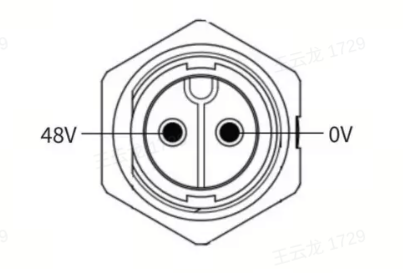

1.5 电气拓展接口
============

1.5.1 背部接口定义
------------------------

**注：背部接口主要有两个模块，头部通讯接线盒和尾部电源接线盒**

| 序号 | 接口 | 接口类型 | 对插型号 | 功能 |
|-----|------|--------|---------|------|
| 1 | 双光云台接口 | M12A-8P母头 | M12A-8P公头 | 接头部双光云台通讯 12V,24V/1.5A 电源 |
| 2 | 激光雷达接口 | M12A-8P母头 | M12A-8P公头 | 接上装激光雷达通讯 24V/2A 电源 |
| 3 | 拓展网络接口 | M12A-17P母头 | M12A-17P公头 | 接扩展网线； 12V,24V,48V/1.5A电源 |
| 4 | 扩展 Type-C接口 | Type-C 防水插座 | USB Type-C | 扩展 USB 3.1 10Gbps 接口 |
| 5 | 12V,24V,48V/15A电源接口 | M12K 母头 | M12K 公头 | 给上装设备电源 12,24,48V/15A输出 |

### 头部接线盒 M12A-8P 母头航插双光云台接口定义

| M12A母头序号 | 定义 | 网线水晶头序号 | 功能 |
|-------------|-----|--------------|-----|
| 1 | 24V 正 |  | 24V 电源正极 |
| 2 | RX+ | 1 | 数据接收正端 |
| 3 | RX- | 2 | 数据接收负端 |
| 4 | TX+ | 3 | 数据发送正端 |
| 5 | TX- | 6 | 数据发送负端 |
| 6 | 空 |  |  |
| 7 | 空 |  |  |
| 8 | 24V 负 |  | 24V 电源负极 |

### 头部接线盒 M12A-8P 母头航插激光雷达接口定义

| M12A母头序号 | 定义 | 网线水晶头序号 | 功能 |
|-------------|-----|--------------|-----|
| 1 | 24V 正 |  | 24V 电源正极 |
| 2 | RX+ | 1 | 数据接收正端 |
| 3 | RX- | 2 | 数据接收负端 |
| 4 | TX+ | 3 | 数据发送正端 |
| 5 | TX- | 6 | 数据发送负端 |
| 6 | 空 |  |  |
| 7 | 空 |  |  |
| 8 | 24V 负 |  | 24V 电源负极 |

### 尾部接线盒 M12A-17P ⺟头航插接⼝定义

| M12A母头序号 | 定义 | 网线水晶头序号 | 功能 |
|-------------|-----|--------------|-----|
| 1 | 48V 正 |  | 48V 电源正极 |
| 2 | RX+ | 1 | 数据接收正端 |
| 3 | RX- | 2 | 数据接收负端 |
| 4 | TX+ | 3 | 数据发送正端 |
| 5 | TX- | 6 | 数据发送负端 |
| 6 | 12V 正 |  | 12V 电源正极 |
| 7 | 12V 负 |  | 12V 电源负极 |
| 8 | 12V 正 |  | 12V 电源正极 |
| 9 | 12V 负 |  | 12V 电源负极 |
| 10 | 24V 正 |  | 24V 电源正极 |
| 11 | 24V 负 |  | 24V 电源负极 |
| 12 | 24V 正 |  | 24V 电源正极 |
| 13 | 24V 负 |  | 24V 电源负极 |
| 14 | 48V 正 |  | 48V 电源正极 |
| 15 | 48V 负 |  | 48V 电源负极 |
| 16 | 48V 正 |  | 48V 电源正极 |
| 17 | 48V 负 |  | 48V 电源负极 |

### 尾部电源M12K母头接口定义

| M12A母头序号 | 定义 | 功能 |
|-------------|-----|-----|
| 1 | 48V 正 | 48V 电源正极 |
| 2 | 48V 负 | 48V 电源负极 |
| 3 | 24V 正 | 24V 电源正极 |
| 4 | 12/24V 负 | 24V 电源负极 |
| PE | 12V 正 | 12V 电源正极 |

1.5.2 左侧接口定义
------------------------

| 序号 | 器件名称 | 型号 | 功能 |
|------|--------|------|-----|
| 1 | 调试接口 | DB15 母头 | 电机 CAN 诊断，电池 CAN 诊断，调试急停 |
| 2 | Wifi 天线 | 2.4G | 无线 Wifi 和主控板通讯 |
| 3 | 蓝牙天线 | 5.2 | 无线蓝牙和主控板通讯 |
| 4 | 气压平衡阀 | M12 | 平衡内外气压 |
| 5 | typec 接口 | E10T-FT3-PWF/MT3-NWA-xxFPC | typec 接口和主控板通讯 |
| 6 | 充电口 | E13T-P2B-PPF-01 | 48V 充电口 |
| 7 | 网口 | E13T-FR5-PRF-180 | 百兆网口/调试网口 |

### 调试口接口定义

### 充电口接口定义

