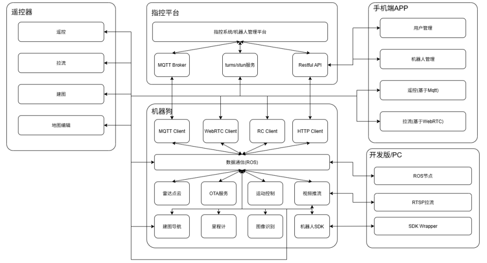

2.1 AGI_MaxPro系统架构
==============

**机器狗**
- 1.MQTT Client负责与云平台的基于MQTT通信，实现包括OTA、状态上报、遥控等功能；​
- 2.WebRTC Client与APP和云平台的turns/stun服务通信，负责视频推流、点云等拉取；​
- 3.RC Client与遥控器通信，实现无线遥控；​
- 4.HTTP CLient与平台侧通信，实现升级包下载、日志上传、地图上传等功能
- 5.通过RTSP进行视频推流
- 6.采用ROS Topic方式进行内部通信

**云平台**
- 1.MQTT用于机器狗上电后建立长连接，负责接收上报状态、心跳、下发指令（如OTA、WebRTC）​
- 2.Restful API对外提供平台服务，也为APP提供用户和设备管理等功能
- 3.turns/stun服务用于建立基于WebRTC的点对点连接，实现p2p的视频推流（当无法建立点对点连接时降级为服务器转发）
- 4.指控系统/机器人管理平台提供机器人全生命周期管理、OTA、地图编辑、远程监控/控制、任务管理等功能；

**APP**
- 1.用户管理/设备管理模块：与平台通过Restful API进行通信。负责用户管理、设备管理及用户和设备绑定关系管理；
- 2.遥控：提供基于MQTT信令通信的远程遥控
- 3.拉流服务：提供基于WebRTC的点对点推流服务

**遥控器**
- 1.遥控：与设备端RC Client通信，提供基于2.4GHz无线遥控功能；
- 2.拉流：基于RTSP的视频拉流；
- 3.建图：以推流方式实现遥控端侧发起/结束建图；​
- 4.地图编辑：通过解析、编辑相关配置文件，实现遥控器端地图编辑的功能，包括地图展示、旋转、缩放、虚拟墙编辑、下发任务等；