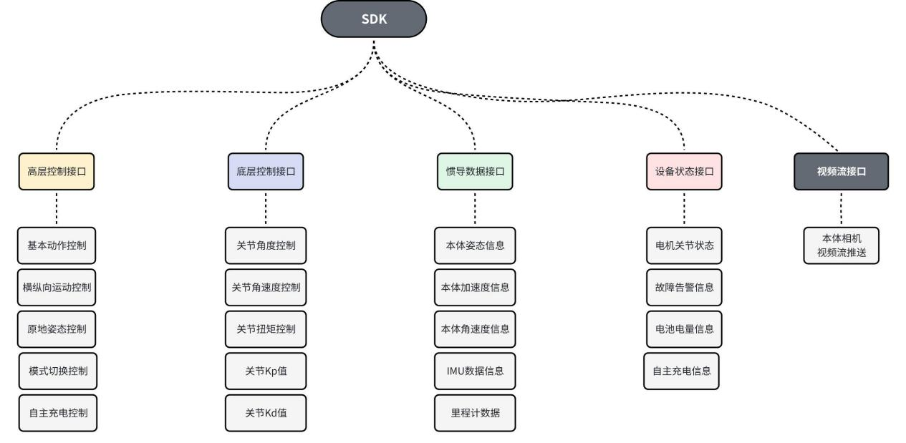

2.3 SDK接口框图
==================

当前已开放运动控制相关SDK接口，包括高层运动控制接口、底层电机控制接口、IMU惯导数据接口、自主回充接口和视频流数据接口。

**高层控制接口：**
主要实现对设备基本运动的控制，包括站立、趴下、前后左右运动、原地姿态控制、强化学习模式及零力矩模式控制和自主充电相关的控制。

**底层控制接口：**
通过ros话题，实现对关节电机的角度、角速度、关节扭矩、Kp值和Kd值等的控制，也可获取各个关节电机的反馈信息。

**惯导数据接口：**
可通过sdk获取本体姿态信息，运行速度数据，角速度数据、IMU数据和里程计数据等。

**设备状态接口：**
可通过sdk获取机器狗运行状态信息，异常告警信息、电池电量信息和自主充电状态反馈数据等。

**视频流接口：**
可通过rtsp协议获取前后广角相机视频流数据。