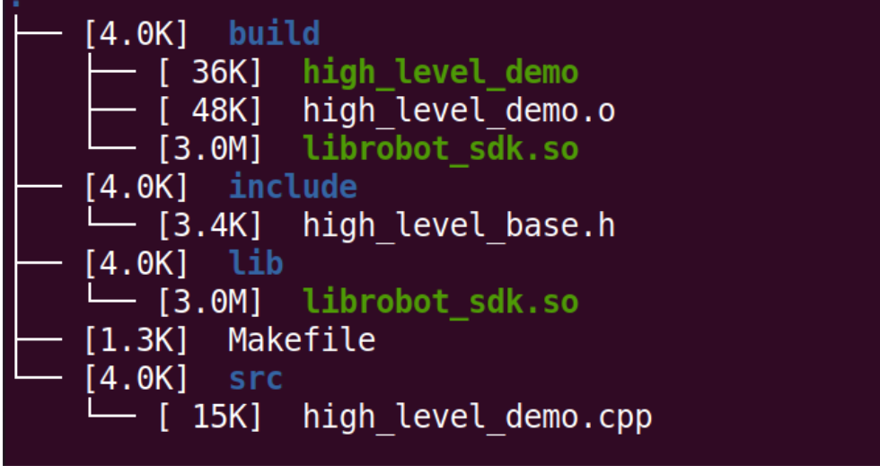
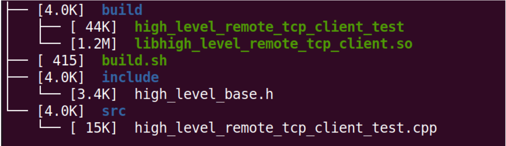

3.5 Demo运行
============

3.5.1 高层sdk安装
-------------------

会根据用户开发环境是否安装ros1系统给到不同的sdk文件<br>
安装ros1系统的sdk文件解压出来目录如下：



执行下面指令，编译成功后即可运行提供的demo程序`high_level_demo.cpp`

```
make clean
make -j6
LD_LIBRARY_PATH=../high_level_remote_tcp_client_test
./high_level_demo
```
未安装ros1系统的zip文件解压出来目录如下：



执行build.sh指令然后就可以运行提供的demo程序`high_level_remote_tcp_client_test.cpp`

```
./build.sh
cd build/
LD_LIBRARY_PATH=../high_level_remote_tcp_client_test
./high_level_remote_tcp_client_test
```

**注：在进行sdk控制时，需要在遥控器端打开sdk控制**

3.5.2 底层sdk安装
-------------------

和高层sdk不同的是，底层sdk不依赖动态库开发，用户只需要编写自己的程序，订阅`rt/lowstate`和发布`rt/lowcmd`这两个话题就可以获取关节信息和控制关节电机